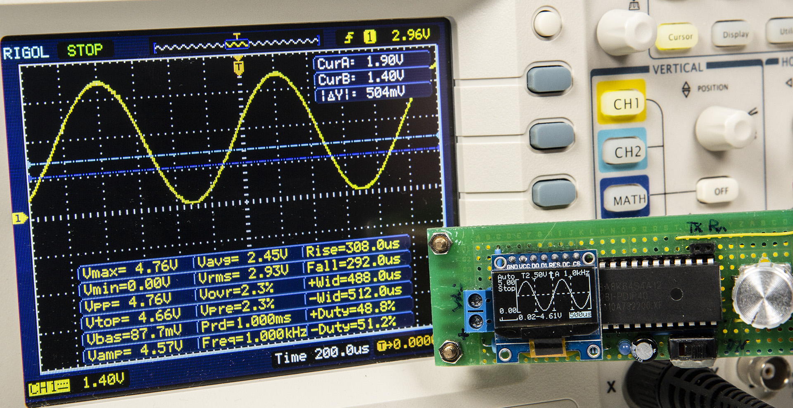
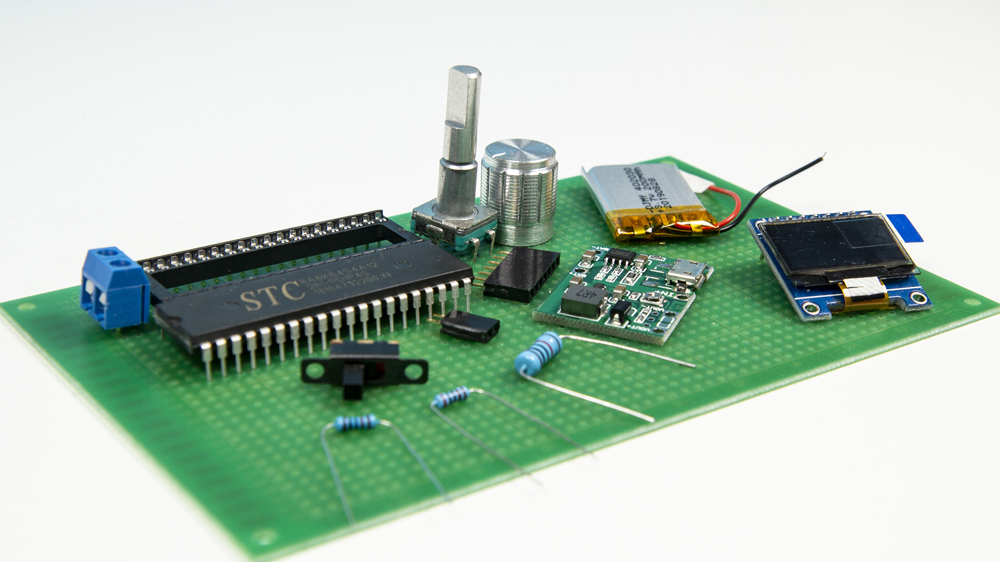
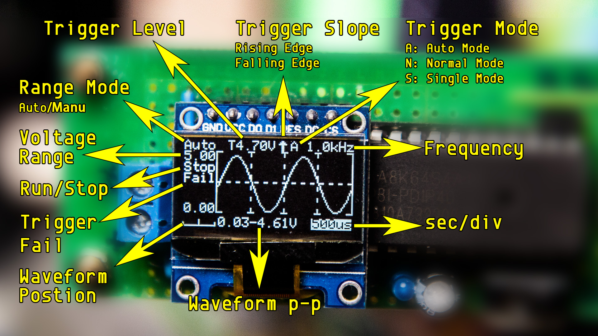
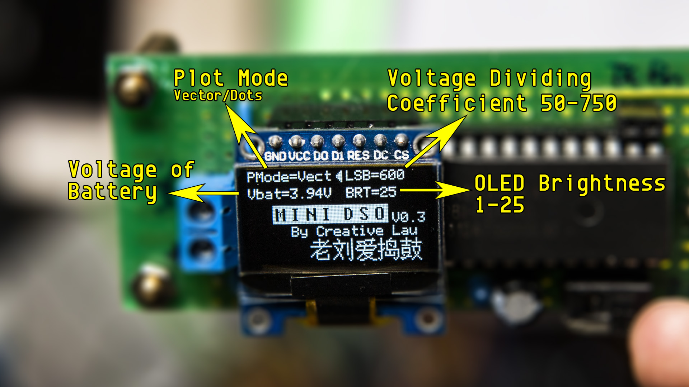
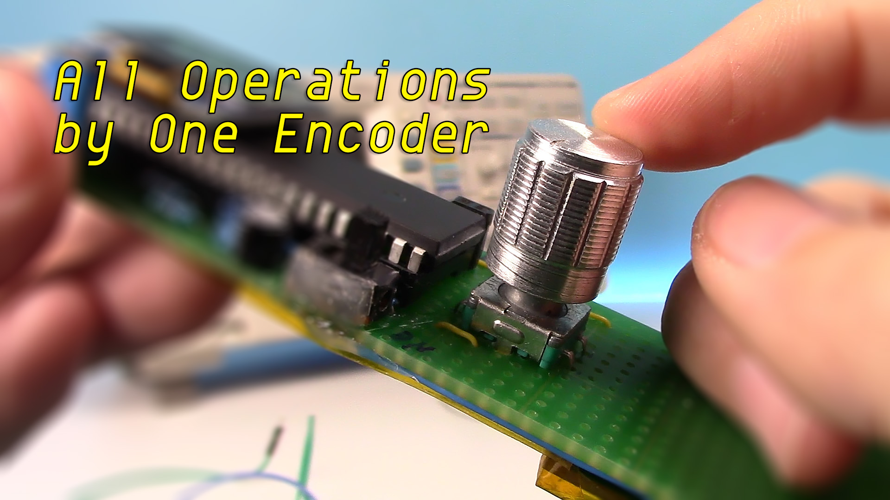

# Mini-TH-DSO 
Open Design and Open Source Open Hardware Development By Thai-Dev
## ดูรีวิวตัวอย่าง 
นี่คือออสซิลโลสโคปอย่างง่ายที่สร้างด้วย STC8A8K MCU เฉพาะส่วนประกอบเซิร์ฟเวอร์และหัวกระสุนง่าย ฟังก์ชันสามารถครอบคลุมการวัดอย่างง่าย
  
## ข้อมูลจำเพาะ 
MCU: STC8A8K64S4A12 @27MHz
จอแสดงผล: 0.96" OLED ความละเอียด 128x64
ตัวควบคุม: ตัวเข้ารหัส EC11 หนึ่งตัว
อินพุต: ช่องเดียว
วินาที/div: 500ms, 200ms, 100ms, 50ms, 20ms, 10ms, 5ms, 2ms, 1ms, 500us, 200us, 100us
100us only available in Auto Trigger Mode
ช่วงแรงดันไฟฟ้า: 0-30V
อัตราการสุ่มตัวอย่าง: 250kHz @ 100us/div  
##รายการวัสดุอุปกรณ์ที่ใช้
  
STC8A8K64S4A12 MCU x 1
SSD1306 OLED(SPI) x 1
ตัวต้านทาน:
1W 10k x 1
1/4W 2k x 2
1/4W 10k x 1
1/4W 5k x 1
ตัวเก็บประจุ:
47uF x 1
0.01uF x 1
LED x 1
ตัวเข้ารหัส EC11 x 1
สวิตช์สลับ x 1
เทอร์มินัล 2 พิน x 1
แถบซ็อกเก็ต:
7 พิน x 1
2 พิน x 1
แบตเตอรี่ลิเธียมไอออน 3.7V
5V Booster Module พร้อมการจัดการการชาร์จ
ดาวน์โหลด USB-TTL
## อินเตอร์เฟซ
  
  
### พารามิเตอร์ในอินเทอร์เฟซหลัก: 
วินาทีต่อกอง: "500ms", "200ms", "100ms", "50ms", "20ms", "10ms","5ms", "2ms", "1ms", "500us", "200us", "100us" "
100us only available in Auto Trigger Mode.
ช่วงแรงดันไฟฟ้า: 0-30V.
ระดับทริกเกอร์: ระดับแรงดันทริกเกอร์
ความลาดชันของทริกเกอร์: ทริกเกอร์บนขอบที่เพิ่มขึ้นหรือลดลง
โหมดทริกเกอร์: โหมดอัตโนมัติ, โหมดปกติ, โหมดเดี่ยว
### สถานะในอินเทอร์เฟซหลัก:
'เรียกใช้': การวิ่งสุ่มตัวอย่าง
'หยุด': การสุ่มตัวอย่างหยุดลง
'ล้มเหลว': ระดับทริกเกอร์เกินรูปคลื่นในโหมดทริกเกอร์อัตโนมัติ
'อัตโนมัติ': ช่วงแรงดันไฟฟ้าอัตโนมัติ
### พารามิเตอร์ในอินเทอร์เฟซการตั้งค่า: 
PMode (โหมดพล็อต): แสดงรูปคลื่นในเวกเตอร์หรือจุด
LSB: สัมประสิทธิ์การสุ่มตัวอย่าง ปรับเทียบแรงดันสุ่มตัวอย่างโดยการปรับ LSB
100 times of voltage dividing coefficient. e.g. the resistor for voltage dividing is 10k and 2k, calculate the voltage dividing coefficient (10+2)/2=6. Get the LSB = 6 x 100 = 600.
BRT (ความสว่าง): ปรับความสว่าง OLED
## ปฏิบัติการ
  
การดำเนินการทั้งหมดเสร็จสิ้นโดย EC11 Encoder อินพุตประกอบด้วยคลิกเดียว, ดับเบิลคลิก, กดแบบยาว, หมุนและหมุนขณะกด ดูเหมือนซับซ้อนเล็กน้อย ไม่ต้องกังวล มีรายละเอียดด้านล่าง ทรัพยากรของตัวเข้ารหัสนี้เกือบหมดแล้ว หากมีคุณสมบัติใหม่ อาจต้องการส่วนประกอบอินพุตเพิ่มเติม

อินเทอร์เฟซหลัก - โหมดพารามิเตอร์
ตัวเข้ารหัสแบบคลิกเดียว: เรียกใช้/หยุดการสุ่มตัวอย่าง
Double Click Encoder: เข้าสู่โหมด Wave Scroll
ตัวเข้ารหัสแบบกดค้าง: เข้าสู่ส่วนต่อประสานการตั้งค่า
หมุนตัวเข้ารหัส: ปรับพารามิเตอร์
หมุนตัวเข้ารหัสขณะกด: สลับระหว่างตัวเลือกต่างๆ
สลับช่วงอัตโนมัติและแบบแมนนวล: หมุนตัวเข้ารหัสตามเข็มนาฬิกาอย่างต่อเนื่องเพื่อเข้าสู่ช่วงอัตโนมัติ หมุนตัวเข้ารหัสทวนเข็มนาฬิกาเพื่อเข้าสู่ช่วงแมนนวล
อินเทอร์เฟซหลัก - โหมดเลื่อนคลื่น
ตัวเข้ารหัสแบบคลิกเดียว: เรียกใช้/หยุดการสุ่มตัวอย่าง
ตัวเข้ารหัสดับเบิลคลิก: เข้าสู่โหมดพารามิเตอร์
ตัวเข้ารหัสแบบกดค้าง: เข้าสู่ส่วนต่อประสานการตั้งค่า
Rotate Encoder: เลื่อนรูปคลื่นในแนวนอน (ใช้ได้เฉพาะเมื่อหยุดการสุ่มตัวอย่าง)
หมุนตัวเข้ารหัสขณะกด: เลื่อนรูปคลื่นในแนวตั้ง (ใช้ได้เฉพาะเมื่อหยุดการสุ่มตัวอย่าง)
อินเทอร์เฟซการตั้งค่า
ตัวเข้ารหัสแบบคลิกเดียว: N/A
ตัวเข้ารหัสดับเบิลคลิก: N/A
ตัวเข้ารหัสแบบกดค้าง: กลับไปที่อินเทอร์เฟซหลัก
หมุนตัวเข้ารหัส: ปรับพารามิเตอร์
หมุนตัวเข้ารหัสขณะกด: สลับระหว่างตัวเลือกต่างๆ
ฟังก์ชั่น
ระดับทริกเกอร์: สำหรับสัญญาณที่เกิดซ้ำ ระดับทริกเกอร์อาจทำให้จอแสดงผลมีเสถียรภาพ สำหรับสัญญาณช็อตเดียว ระดับทริกเกอร์สามารถจับได้
ความชันของทริกเกอร์: ความชันของทริกเกอร์กำหนดว่าจุดทริกเกอร์อยู่บนขอบขาขึ้นหรือขาลงของสัญญาณ
โหมดทริกเกอร์:
โหมดอัตโนมัติ: กวาดต่อเนื่อง คลิกครั้งเดียวที่ตัวเข้ารหัสเพื่อหยุดหรือเรียกใช้การสุ่มตัวอย่าง หากทริกเกอร์ รูปคลื่นจะแสดงบนจอแสดงผล และตำแหน่งทริกเกอร์จะอยู่ที่กึ่งกลางของแผนภูมิ มิฉะนั้น รูปคลื่นจะเลื่อนไม่ปกติ และ 'ล้มเหลว' จะแสดงบนจอแสดงผล
โหมดปกติ: เมื่อทำการสุ่มตัวอย่างล่วงหน้าเสร็จแล้ว คุณสามารถป้อนสัญญาณได้ หากทริกเกอร์ รูปคลื่นจะแสดงบนจอแสดงผลและรอทริกเกอร์ใหม่ หากไม่มีทริกเกอร์ใหม่ รูปคลื่นจะถูกเก็บไว้
โหมดเดี่ยว: เมื่อทำการสุ่มตัวอย่างล่วงหน้าเสร็จแล้ว คุณสามารถป้อนสัญญาณได้ หากถูกกระตุ้น รูปคลื่นจะแสดงบนจอแสดงผลและหยุดการสุ่มตัวอย่าง ผู้ใช้ต้องคลิกเพียงครั้งเดียว Encoder เพื่อเริ่มการสุ่มตัวอย่างครั้งต่อไป
สำหรับโหมดปกติและโหมดเดี่ยว ตรวจสอบให้แน่ใจว่าได้ปรับระดับทริกเกอร์อย่างถูกต้อง มิฉะนั้นจะไม่แสดงรูปคลื่นบนจอแสดงผล
ตัวบ่งชี้: โดยทั่วไป ตัวบ่งชี้บนหมายถึงการสุ่มตัวอย่างกำลังทำงาน การใช้งานที่สำคัญกว่านั้นอยู่ในโหมดทริกเกอร์เดี่ยวและปกติ ก่อนที่จะเข้าสู่สเตจทริกเกอร์ จำเป็นต้องมีการสุ่มตัวอย่างล่วงหน้า ตัวบ่งชี้จะไม่เปิดขึ้นในระหว่างขั้นตอนการสุ่มตัวอย่าง เราไม่ควรป้อนสัญญาณจนกว่าตัวบ่งชี้จะสว่างขึ้น ยิ่งเลือกมาตราส่วนเวลาที่นานขึ้น เวลารอการสุ่มตัวอย่างล่วงหน้านานขึ้น
บันทึกการตั้งค่า: เมื่อออกจากอินเทอร์เฟซการตั้งค่า พารามิเตอร์ทั้งหมดในการตั้งค่าและอินเทอร์เฟซหลักจะถูกบันทึกไว้ใน EEPROM
กวดวิชา
เวอร์ชันแรก: วิธีการ bulit ทีละขั้นตอน
Bilibili: https://www.bilibili.com/video/BV1ai4y1t79R
ยูทูบ: https://youtu.be/c6gBv6Jcz7w
คำแนะนำ: https://www.instructables.com/id/Make-Your-Own-OscilloscopeMini-DSO-With-STC-MCU-Ea/
V0.3: การเปลี่ยนแปลงในเวอร์ชันใหม่ การแทรกระหว่างอินเทอร์เฟซ การทำงาน และฟังก์ชัน
บิลิบิลิ: https://www.bilibili.com/video/bv1XV411k7UV
YouTube: https://youtu.be/-8PadlS7c4c
คำแนะนำ: https://www.instructables.com/id/Upgrade-DIY-Mini-DSO-to-a-Real-Oscilloscope-With-A/
แผนเพิ่มเติม
เนื่องจากมีปัญหาการสุ่มตัวอย่างกระโดดใน STC8A8K และไม่ได้รับความนิยมจนหายาก ฉันตัดสินใจโอนโครงการนี้ไปที่ STM32 ในขณะเดียวกัน ฉันจะพยายามหาวิธีง่ายๆ ในการวัดแรงดันลบ
